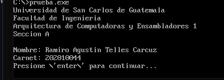
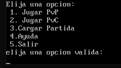

# Manual De Usuario
# Practica 3 Arquitectura de Computadores y Ensambladores 1

## **Objetivos e Información del Sistema**

Este Programa hecho en assembler se trata de un juego de conecta 4 el cual se juega desde consola, este programa permite jugar con uno mismo o contra la máquina.

## Requisitos del sistema

------------
*  DOSBox
* MASM611

## Interfaz

Esta iniciará mostrando los datos personales del programador. Luego pedirá que se presione enter para continuar.

Luego este redirigirá al usuario al menú principal donde tiene las siguientes opciones:

* PvP(Jugador contra Jugador)
* PvC(Jugador contra CPU)
* Cargar Partida
* Ayuda
* Salir

### Juego

Al iniciar el juego PvP, este pedirá los nombres de 2 jugadores para la partida.

Si se eligió el juego PvE, este solo pedirá el nombre del primer jugador.