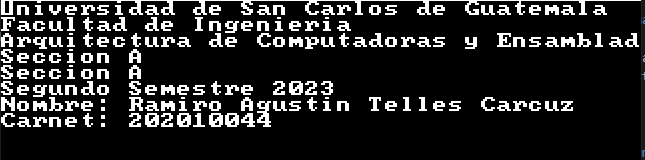
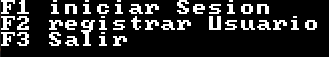
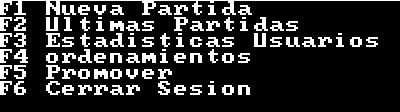
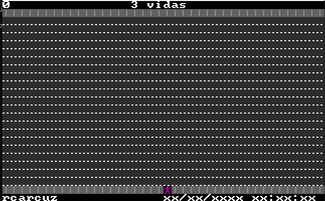

# Manual De Usuario
# proyecto 2 Arquitectura de Computadores y Ensambladores 1

## **Objetivos e Información del Sistema**

Este programa hecho en assembler se trata de un CRUD de usuarios, en el que se pueden ingresar usuarios y guardarlos en disco duro. Este también tiene un juego el cuál se trata de crusar la calle con un personaje mientras se esquivan los automóviles.

## Requisitos del sistema

------------
*  DOSBox
* MASM611

## Interfaz

Esta iniciará mostrando los datos personales del programador. 

Luego este redirigirá al usuario al menú principal donde tiene las siguientes opciones:

* Iniciar Sesion
* Registrar
* salir

En iniciar Sesión se le pedirá el usuario y contraseña al usuario para loguearse y así poder acceder a las funcionalidades.

El apartado de registrar sirve para registrar nuevos usuarios al sistema.

Con salir, se cierra el programa.

### Menu Funcionalidades

Al acceder como administrador real, se podran acceder al siguiente conjunto de funcionalidades.

* Nueva Partida
* Ultimas Partidas
* Estadisticas Usuarios
* Ordenamientos
* Promover
* Cerrar Sesion

El apartado de nueva partida inicia una nueva partida del juego de cruzar el camino.

El apartado de Últimas Partidas, muestra las estadisticas del usuario logueado.

El apartado de Estadisticas Usuarios es capaz de mostrar las estadísticas de los demás usuarios.

El apartado de ordenamientos muestra un ordenamiento en tiempo real.

El apartado de Promover, sirve para convertir usuarios normales en usuarios admin.

Con el apartado de cerrar Sesion, se cierra sesión, y vuelve al menú principal.

### Juego

El juego se trata de controlar al personaje y hacerlo cruzar la calle esquivando los automóviles que circulan por la autopista, el personaje irá acumulando puntos si logra cruzar; pero perderá vidas si es tocado por algún automóvil, y en total solo se tienen 3 vidas. Si se pierden las 3 vidas, el juego acaba.

